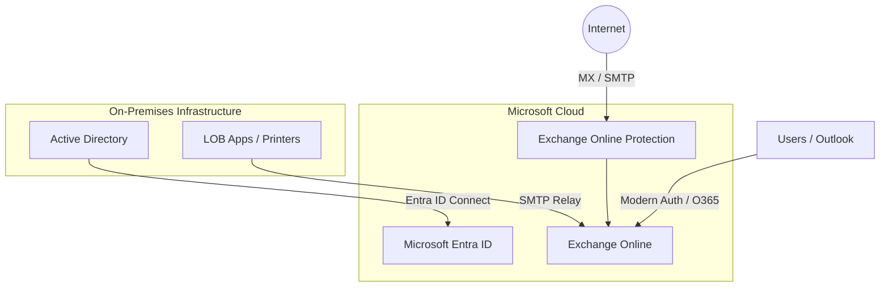
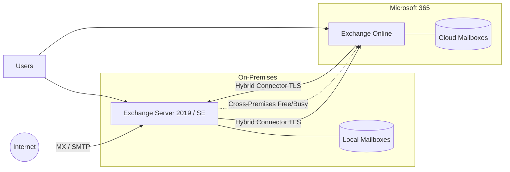
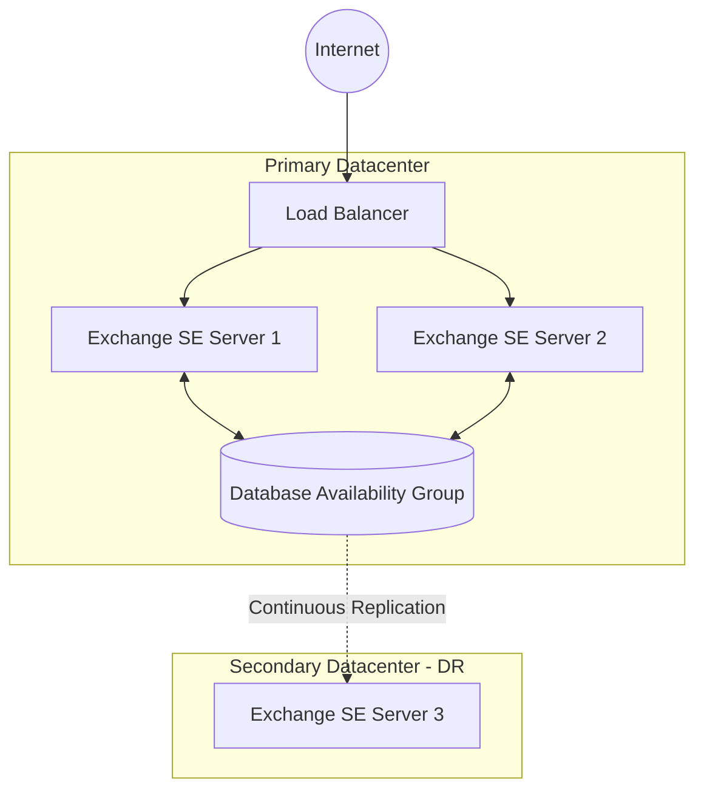

# Architecture & Solution Design
{: .no_toc }

Visual representations of the primary migration paths and solution architectures for Exchange Server End of Support.
{: .fs-6 .fw-300 }

  
Table of contents

  {: .text-delta }
1. TOC
{:toc}

---

## Use Case 1: Microsoft 365 / Exchange Online (Cloud First)

The **Cloud First** strategy is recommended for organizations seeking the lowest TCO and a modern, always-up-to-date mail infrastructure. ([Exchange Online documentation](https://learn.microsoft.com/en-us/exchange/exchange-online))

### Key Components:
- **Microsoft Entra ID:** Provides identity synchronization and Single Sign-On (SSO) ([Entra ID hybrid identity](https://learn.microsoft.com/en-us/entra/identity/hybrid/whatis-hybrid-identity)).
- **Exchange Online Protection (EOP):** Handles anti-spam and anti-malware filtering ([EOP documentation](https://learn.microsoft.com/en-us/exchange/security/exchange-online-protection-overview)) as the primary entry point.
- **SMTP Relay:** Local devices and applications are updated to relay directly to the cloud ([SMTP authentication](https://learn.microsoft.com/en-us/exchange/clients-and-mobile/smtp-auth)) or via a simplified on-premises relay.

---

## Use Case 2: Hybrid Coexistence (Transitional/Long-Term)

The **Hybrid** architecture is ideal for large organizations that need a phased migration or have specific compliance requirements that keep some mailboxes on-premises. 

### Key Components:
- **Hybrid Configuration Wizard (HCW):** Establishes the trust and secure mail flow between environments .
- **Shared Namespace:** Users share the same `@company.com` domain regardless of where their mailbox is located .
- **Cross-Premises Free/Busy:** Allows users to see each other's calendar availability  during the transition.

---

## Use Case 3: On-Premises Modernization (Exchange Server SE)

The **On-Premises** strategy is for organizations that must maintain data sovereignty due to strict regulatory or data residency requirements. ([Exchange Server SE](https://learn.microsoft.com/en-us/exchange))

### Key Components:
- **Database Availability Group (DAG):** Provides high availability and continuous replication ([DAG architecture](https://learn.microsoft.com/en-us/exchange/architecture/database-availability-groups)) of mailbox databases.
- **Exchange Server SE:** The subscription-based successor to Exchange 2019 , ensuring a supported on-premises environment.
- **Load Balancer:** Distributes client traffic across multiple servers to ensure service availability ([High availability](https://learn.microsoft.com/en-us/exchange/architecture/high-availability)).
